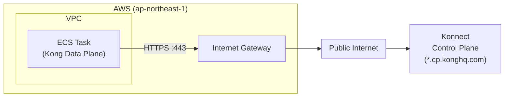
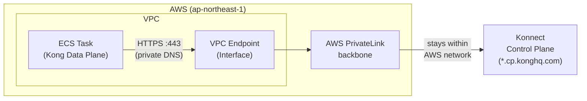

# Kong Gateway Data Plane on AWS ECS (Fargate) with Terraform

This project contains Terraform code to deploy Kong Gateway (Data Plane) on AWS ECS (Fargate).
It integrates with Konnect Control Plane and handles automatic certificate generation and registration.

## File Structure

```text
.
├── alb.tf              # Application Load Balancer (ALB), Target Group, Listener
├── cloudwatch.tf       # CloudWatch Log Group (for ECS logs)
├── ecs.tf              # ECS Cluster, Task Definition, Service
├── env.sh              # Environment variable configuration file (excluded from git)
├── iam.tf              # ECS Task Execution Role
├── konnect.tf          # Konnect integration (Control Plane lookup, Certificate generation/registration)
├── outputs.tf          # Output definitions (ALB DNS name, etc.)
├── private_link.tf     # AWS PrivateLink VPC Endpoint and Security Group (optional)
├── providers.tf        # Terraform Provider settings (AWS, Konnect, TLS)
├── run.sh              # Execution script
├── security_groups.tf  # Security Groups (for ALB, ECS Tasks)
├── variables.tf        # Variable definitions
└── vpc.tf              # VPC, Subnet, Internet Gateway, Route Table
```

## File Overview

- **alb.tf**: Defines the Load Balancer accepting external access. Health checks are performed on `/status/ready` (port 8100).
- **cloudwatch.tf**: Defines the log group `/ecs/kong-dp` for storing ECS task logs.
- **ecs.tf**: Defines the Fargate Task and Service for running Kong Gateway. Connection settings for Konnect are injected as environment variables.
- **iam.tf**: Defines IAM roles for ECS tasks to send logs and pull images.
- **konnect.tf**: Uses the Konnect Provider to dynamically generate a client certificate for the Data Plane and register it with Konnect.
- **private_link.tf**: Optionally creates an AWS PrivateLink Interface Endpoint and its Security Group. Controlled by the `enable_private_link` variable. When enabled, Konnect hostnames resolve to private IPs within the VPC via private DNS — no changes to Kong Data Plane configuration are required.
- **security_groups.tf**:
    - For ALB: Allows HTTP (80) from specified CIDRs (default is specific IP only).
    - For ECS Tasks: Allows traffic only from ALB (8000, 8100).
    - For VPC Endpoint (when PrivateLink enabled): Allows HTTPS (443) from ECS Tasks.
- **vpc.tf**: Builds the VPC network environment for the application.
- **variables.tf**: Defines project-wide variables (Region, App Name, CIDR, PrivateLink settings, etc.).

## Usage

### 1. Prerequisites
- Terraform installed
- AWS CLI configured (e.g., `aws configure`)
- Konnect account and Personal Access Token (PAT)

### 2. Configure Environment Variables
Create (or edit) the `env.sh` file and set your Konnect PAT.

Also, the Security Group restricts inbound traffic to a specific IP by default. You must configure it to allow access from your client's IP address.

```bash
# env.sh
export TF_VAR_konnect_personal_access_token="your_konnect_pat_here"

# Set your IP address (CIDR format) to allow access to the ALB
# Example: export TF_VAR_allowed_cidr_blocks='["203.0.113.1/32"]'
export TF_VAR_allowed_cidr_blocks='["YOUR_IP_ADDRESS/32"]'

# --- AWS PrivateLink (optional) ---
# Uncomment to enable private connectivity between ECS Data Plane and Konnect.
# Look up the service name for your region and Konnect geo:
# https://developer.konghq.com/gateway/aws-private-link/
#
# export TF_VAR_enable_private_link=true
# export TF_VAR_konnect_private_link_service_name="com.amazonaws.vpce.ap-northeast-1.vpce-svc-xxxxxxxxxxxxxxxxx"
```

### 3. Execution

Use the included script to manage the infrastructure lifecycle.

```bash
chmod +x run.sh

# Start (Init & Apply)
./run.sh start

# Stop (Destroy)
./run.sh stop
```

The script performs the following steps:
- `start`: Loads environment variables, runs `terraform init`, and then `terraform apply`.
- `stop`: Loads environment variables and runs `terraform destroy`.

### 4. Verification
After `terraform apply` completes, access the output ALB DNS name to verify operation.

```bash
curl http://<alb_dns_name>/
```

---

## Using AWS PrivateLink (Optional)

By default, the Kong Data Plane connects to the Konnect Control Plane over the public internet.
Enabling AWS PrivateLink routes this traffic through a private VPC Interface Endpoint, keeping it within the AWS network.

### Network traffic flow

**Without PrivateLink** (`enable_private_link = false`):



**With PrivateLink** (`enable_private_link = true`):



### How it works

When `enable_private_link = true`:

1. An AWS VPC Interface Endpoint is created in your VPC subnets.
2. Private DNS is enabled on the endpoint, so Konnect hostnames (e.g. `*.cp.konghq.com`) automatically resolve to private IPs within the VPC.
3. No changes to Kong Data Plane configuration are needed — the existing environment variables work as-is.

### Step 1: Look up the PrivateLink service name

Find the service name for your **AWS region** and **Konnect geo** (US / EU / AU / AP) in the official docs:

[https://developer.konghq.com/gateway/aws-private-link/](https://developer.konghq.com/gateway/aws-private-link/)

Service names for `ap-northeast-1` (Tokyo):

| Konnect Geo | Service Name                                                   |
|-------------|----------------------------------------------------------------|
| AU          | `com.amazonaws.vpce.ap-northeast-1.vpce-svc-05a555912c88c3403` |
| EU          | `com.amazonaws.vpce.ap-northeast-1.vpce-svc-01c086f3cb2a8e3b1` |
| GLOBAL      | `com.amazonaws.vpce.ap-northeast-1.vpce-svc-0a5ef5e9cd65b180a` |
| IN          | `com.amazonaws.vpce.ap-northeast-1.vpce-svc-0f1fed745c08bb4c2` |
| ME          | `com.amazonaws.vpce.ap-northeast-1.vpce-svc-012f363a353acc0af` |
| SG          | `com.amazonaws.vpce.ap-northeast-1.vpce-svc-08b4f9a82fe4dd518` |
| US          | `com.amazonaws.vpce.ap-northeast-1.vpce-svc-087f56ff74f855a49` |

For other regions, refer to the official docs linked above.

Use the service name matching your **Konnect account's geo** (e.g. US). The `GLOBAL` entry corresponds to the Konnect management API (`global.api.konghq.com`) and is only needed if you also want to route management tool traffic (Terraform, CLI, etc.) through PrivateLink. For securing Data Plane connectivity only, the geo-specific entry (e.g. US) is sufficient.

### Step 2: Configure env.sh

Add the following to your `env.sh`.
The example below is for `ap-northeast-1` (Tokyo) with Konnect **US** geo:

```bash
export TF_VAR_enable_private_link=true
export TF_VAR_konnect_private_link_service_name="com.amazonaws.vpce.ap-northeast-1.vpce-svc-087f56ff74f855a49"
```

### Step 3: Apply

```bash
./run.sh start
```

The VPC Endpoint status will show `pending` immediately after creation. It transitions to `available` in approximately 10 minutes. The Kong Data Plane will establish its connection to Konnect once the endpoint becomes available.

### Step 4: Verify the endpoint

After apply completes, check the endpoint ID and DNS entries from the Terraform output:

```bash
terraform output vpc_endpoint_id
terraform output vpc_endpoint_dns_entries
```

You can also verify the endpoint status in the AWS Console under **VPC > Endpoints**.
